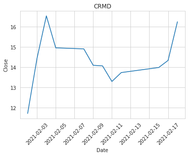
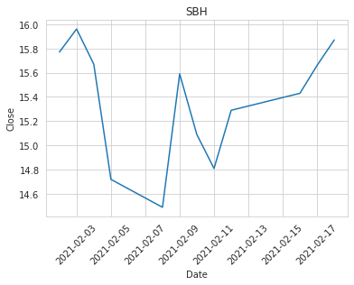
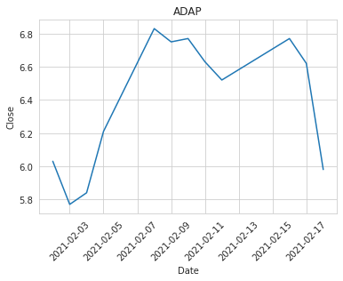

# Finra gets data from various exchanges and posts it on a daily basis. The idea of a project is that when during 3 days in a row short volume for a specific stock moves in the same direction it is an indicator to daytrade the stock for the following day.
## We got 105 such stocks for the period from Feb 16 till Feb 18. And in order to reduce that list(that we actually reduced down to just 3) we use FinViz scanner.

  

2 out of 3 stocks closed higher than they did yesterday and all of them had positive highs, so if we to implement that strategy we need to place a take profit on the opening of the market at 5%.
